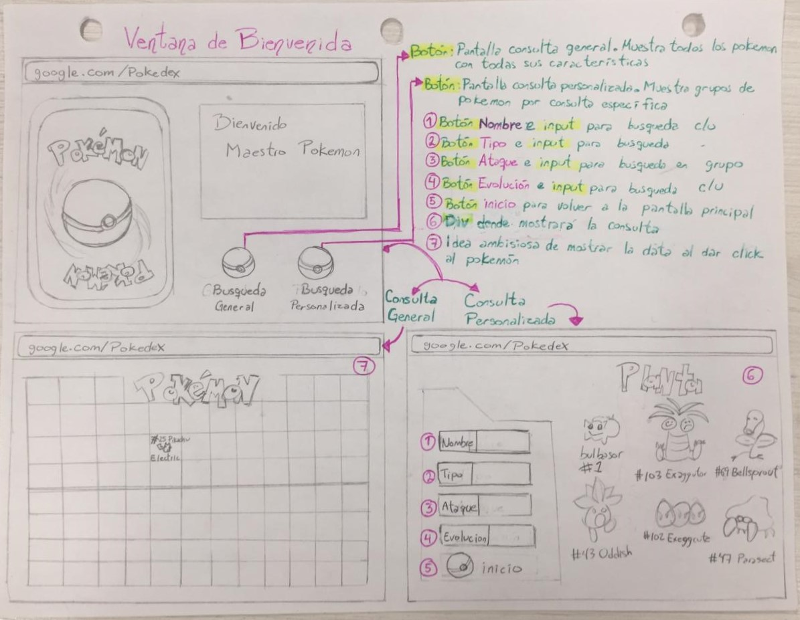
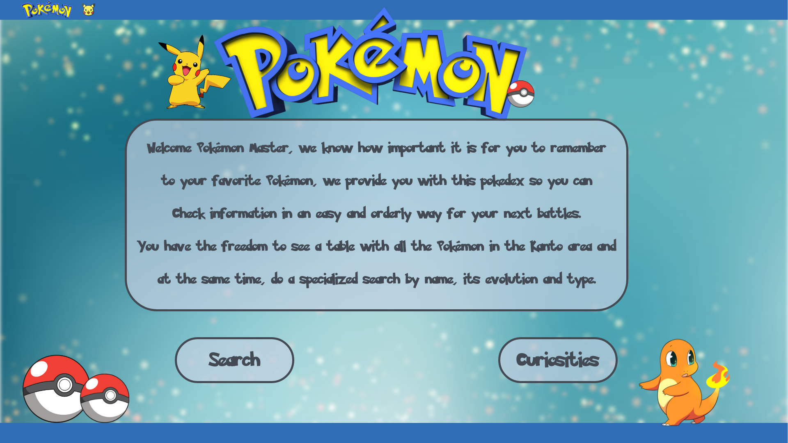
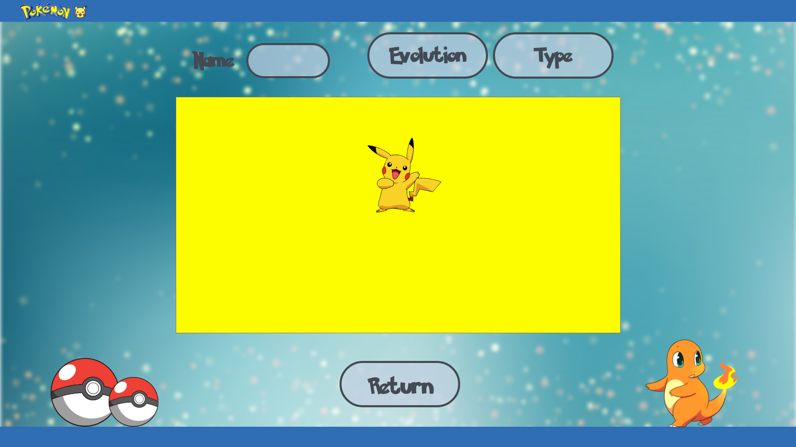
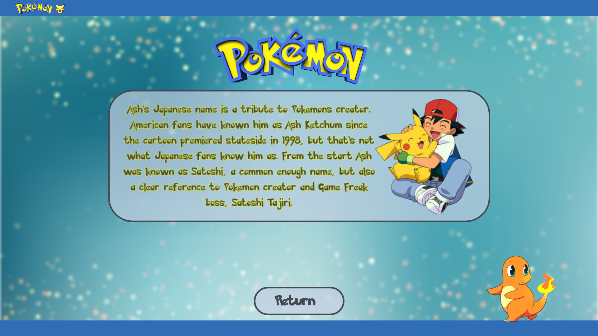
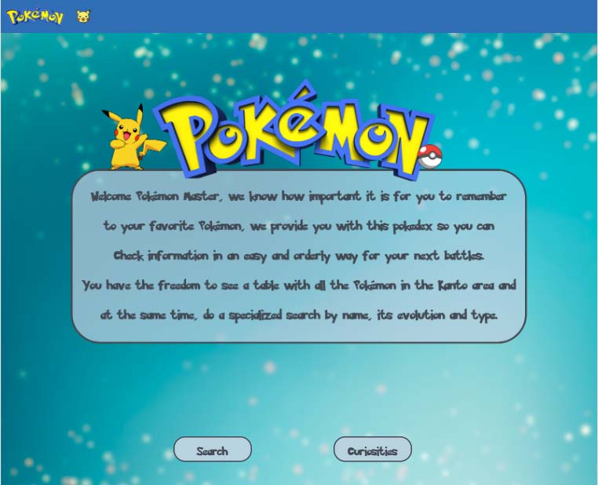
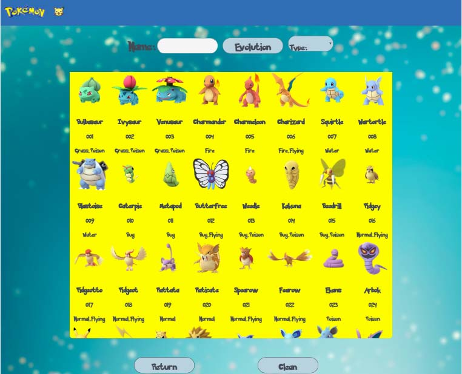
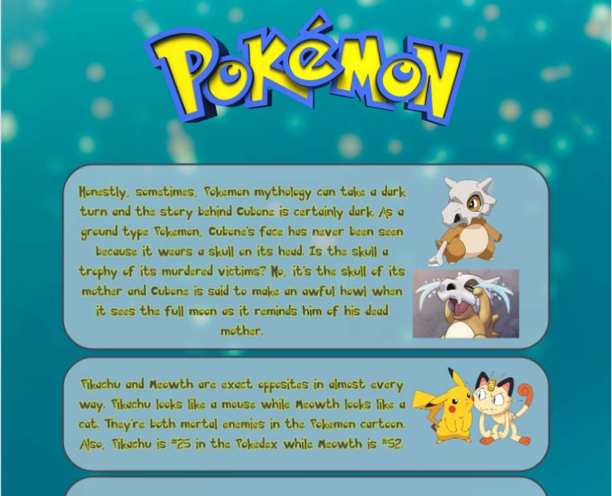

# Data Lovers: Pokédex

## Índice
* [1. Preámbulo](#1-Preámbulo)
* [1. Historias de Usuario](#1-Historias-de-Usuario)
* [2. Diseño de la Interfaz de Usuario](#2-Diseño-de-la-Interfaz-de-Usuario)
* [3. Prototipo de baja fidelidad](#3-Prototipo-de-baja-fidelidad)
* [4. Prototipo de Alta fidelidad](#4-Prototipo-de-alta-fidelidad)
* [5. Testeos de Usabilidad](#5-Testeos-de-Usabilidad)

## *Preámbulo*
Se desarrollo una página web que permite realizar búsquedas de Pokémons de la región Kanto para jugadores de Pókemon Go llamada "Pokédex" es accesible, de uso rápido para consultar cuando el usuario está jugando o simplemente para una búsqueda rápida. El diseño es responsivo y se adapta a varios formatos.

## *Historias de Usuario* 💻
Para  entender qué es lo que los jugadores necesitan en una página web, tomamos en cuenta 3 necesidades para implementar nuestro diseño y las funcionalidades. 
Yo como jugadro de PókmonGo quiero: 

- Saber cúales pokemons corresponden a cada tipo y poderlos filtrar para elegir el pokemón adecuado para una batalla.

- Poder buscar un pokémon por su nombre para obtener su información más relevante (Nombre, número y tipo).

- Conocer cuál es su o sus evoluciones e identificar que cualidades tendrá mi pokémon en sus futuras evoluciones.

Además de cubrir con estas necesidades quisimos darle un toque divertido a la aplicación incluyendole una sección de datos curiosos  para momentos de ocio que pudiera tener nuestro usuario. 

## *Diseño de la Interfaz de Usuario* 
Requerimientos:
-Tres pantallas.
-Colores que evoquen a Pokémon.
-Filtrar pokemons según su tipo.
-Buscar un Pokémon específico por su nombre.
-Mostrar las evoluciones de un Pokémon específico.

### *Prototipo Baja Fidelidad* ✏️

Una vez teniendo la información de búsqueda comenzamos a desarrollar un primer boceto:

En este primer diseño consideramos tener 3 pantallas, una de bienvenida, otra para búsqueda general y otra donde pudieran filtrar información.

### *Prototipo Alta Fidelidad* 🎨

Se desarrolló un prototipo digital en donde se decidieron colores, tipografía y la maquetación, que tendría la página web. El diseño de Interfaz de Usuario se realizó en XD Adobe.

### *Testeos de Usabilidad* 📝

Se realizó un testeo a 4 posibles usuarios con el prototipo de alta fidelidad.

Objetivos de testeo:
-Probar la usabilidad de los filtros en la página web.
-Probar el diseño en las pantallas.
-Probar usabilidad de la herramienta “Evolución”.

Conclusiones del testeo
-Cambiar nuestra página web de español a inglés.
-Indicar un botón para refrescar la pantalla de búsqueda. 

### *Propuesta Final*

